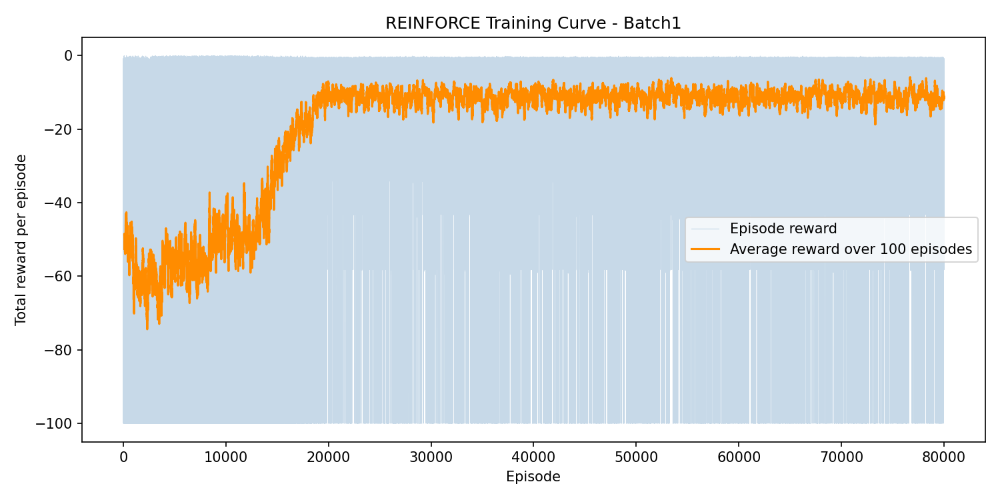
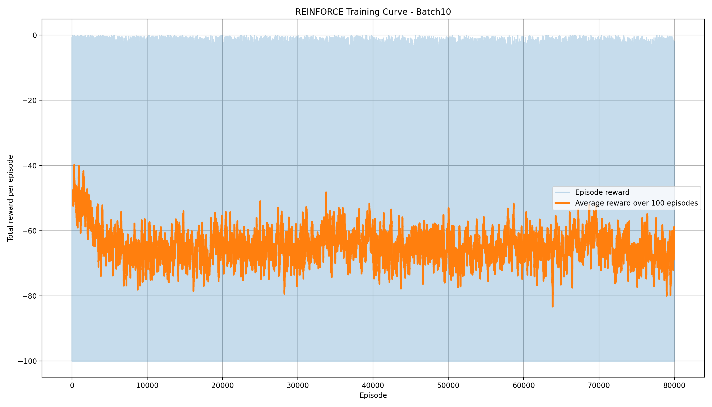
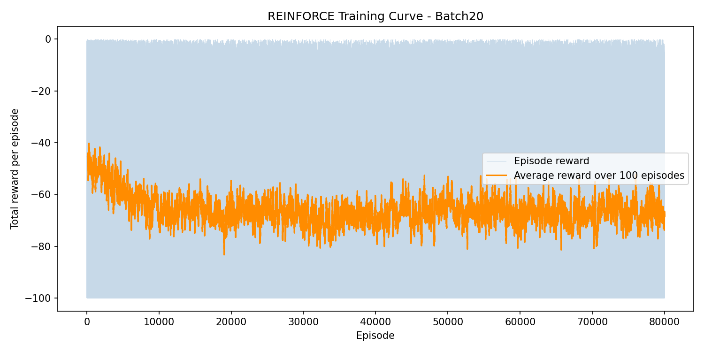

# Symbolic Regression with Reinforcement Learning

---

## Project Structure

```
Symbolic_Rl/
│
├── data_loader.py        # Loads the Feynman equation datasets from disk
├── grammar.py            # Defines the rules for building valid expressions
├── env.py                # The RL environment the agent interacts with
├── policy.py             # The neural network that decides what to write next
├── reward.py             # Scores the finished expression against the data
├── train_reinforce.py    # Runs the training loop
└── __init__.py           # Package setup
```

---

## How the Agent Builds Expressions

The agent uses a simple grammar to build expressions as a tree. It starts with a blank and keeps expanding it using allowed rules until the expression is complete.

```
S → E
E → T | T + E | T - E
T → F | F * T | F / T
F → sq(U) | cube(U) | U
U → sin(A) | cos(A) | tanh(A) | neg(A) | A
A → X | C | (E)
X → x1 | x2 | ... | xn
C → 1 | 2 | pi | e
```


---

## Dataset

Each dataset file is a plain text table where each row is one data point. All columns except the last are inputs (`x1, x2, ...`) and the last column is the output `y`.

Files are read from:
```
data/Feynman_with_units/
```

They are automatically split 70% training, 15% validation, 15% test.

---

## Installation

```bash
pip install numpy torch gymnasium sympy
```

---

## Running Training

Training was run on an HPC cluster using SLURM with an NVIDIA RTX 3080 GPU. The job script used:

```bash
#!/bin/bash
#SBATCH --job-name=symbolic_rl
#SBATCH --partition=rtx3080
#SBATCH --gres=gpu:1
#SBATCH --time=24:00:00
#SBATCH --cpus-per-task=8
#SBATCH --output=logs/train_%j.out
#SBATCH --error=logs/train_%j.err

cd ~/SR_project
mkdir -p logs

module load python/pytorch2.6py3.12

```

To submit the job:

```bash
sbatch train_job.sh
```

To run locally without SLURM:

```bash
python -m symbolic_rl.train_reinforce --episodes 80000 --checkpoint-dir runs/batch20/checkpoints
```


---

### Batch1 — `batch_episodes = 1`

**Training curve:**



---

### Batch10 — `batch_episodes = 10`


**Training curve:**



---

### Batch20 — `batch_episodes = 20`


**Training curve:**




---

### Comparison

| Setting | Batch1 | Batch10 | Batch20 |
|---|---|---|---|
| Episodes | 80,000 | 80,000 | 80,000 |
| Batch size | 1 | 10 | 20 |
| Update frequency | Every episode | Every 10 eps | Every 20 eps |
| Gradient stability | Most noisy | Moderate | Most stable |
| Learning curve | Clear improvement | Flat/noisy | Flat/noisy |

---

## Output Files

| File | What it contains |
|---|---|
| `checkpoints/best_policy.pt` | The best model found during training |
| `training_log.csv` | Reward and expression logged per episode |
| `best_expressions.txt` | Best expression per equation at the end |


